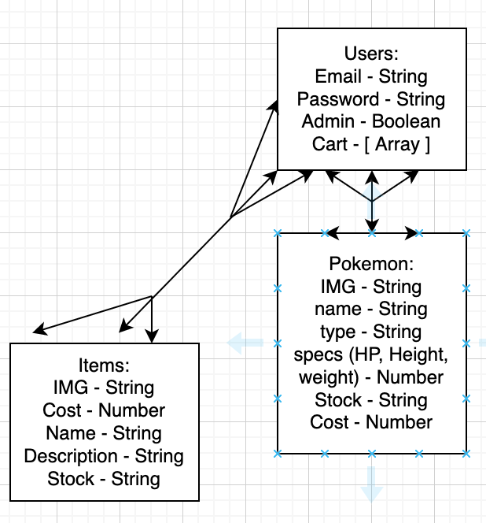
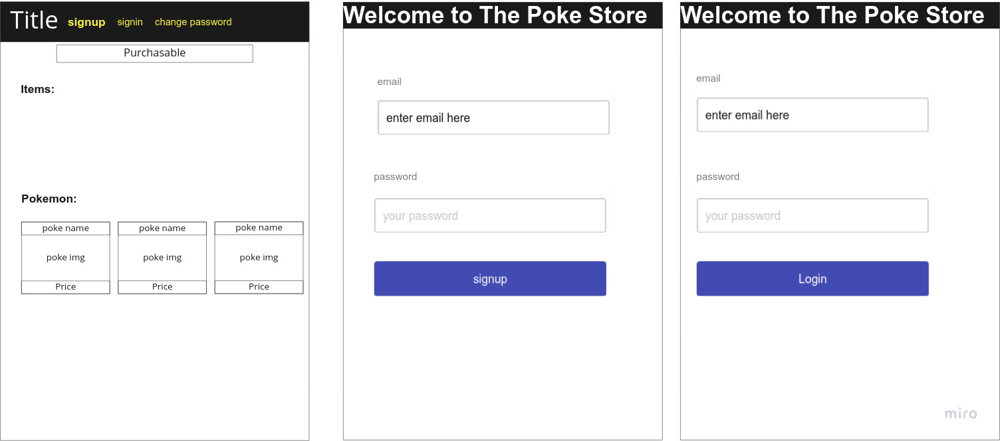
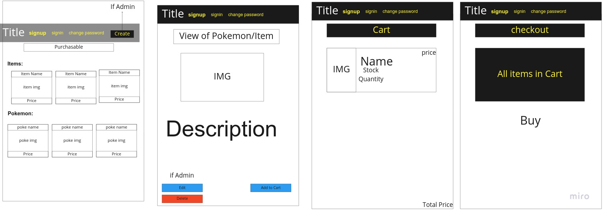

#poke_store_client
A front end client app for buying pokemon and pokemon accessories 

##Prompt

E-Commerce Store

##Installation

##About

##Roles

    -Project Manager: Christian Brewer
    -Front-end SME: Mahider Mengiste
    -Back-end SME: Jaden Ruplal

##ERD

##Wireframes

##API

https://pokeapi.co/?ref=public-apis

##User Stories

    -As an unregistered user, I would like to sign up with email and password.
    -As a registered user, I would like to sign in with email and password.
    -As a signed in user, I would like to change password.
    -As a signed in user, I would like to sign out.
    -As an unregistered user, I would like to see all of the products.
        -Does not show Buy Button
        -Be able to filter by categories
    -As a signed in user, I would like to add and remove products from a shopping cart.
    -As a signed in user, I would like to purchase products in a shopping cart using Stripe with react https://github.com/azmenak/react-stripe-checkout
    -As a signed in user, I would like to see all my past orders.

    ###Stretch
        -Have a search function
        -Build wishlist
        -Have suggested items under each item show page

