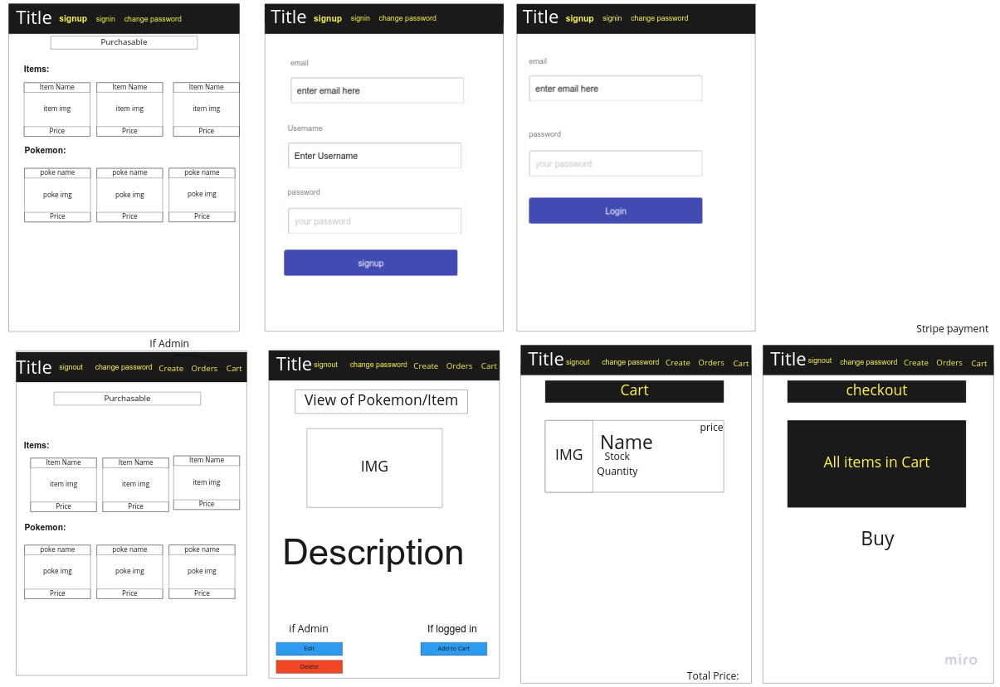

# poke_store_client
A front end client app for buying pokemon and pokemon accessories 

## Prompt

E-Commerce Store

## Installation

## About

The client is where the user interacts with the store. Here is where a user can buy approximately 55 items via one bulk purchase in a cart or single items they wish to purchase.  

## Roles

    -Project Manager: Christian Brewer
    -Front-end SME: Mahider Mengiste
    -Back-end SME: Jaden Ruplal

## Wireframes

## API

https://github.com/christian-the-brewer/poke_store_api

## User Stories

    -As an unregistered user, I would like to sign up with unique email and username, a password, and whether an admin or not.
    -As a registered user, I would like to sign in with email and password.
    -As a signed in user, I would like to change password.
    -As a signed in user, I would like to sign out.
    -As an unregistered user, I would like to see all of the products.
        -Does not show Buy Button
        -Be able to filter by categories
    -As a signed in user, I would like to add and remove products from a shopping cart.
    -As an admin, I would like to:
        -Create pokemon and items
        -Update pokemon and items
        -Delete pokemon and items
    -As a signed in user, I would like to purchase products in a shopping cart using Stripe with react https://github.com/azmenak/react-stripe-checkout
    -As a signed in user, I would like to see all my past orders.

    ### Stretch
        -Have a search function
        -Build wishlist
        -Have suggested items under each item show page

